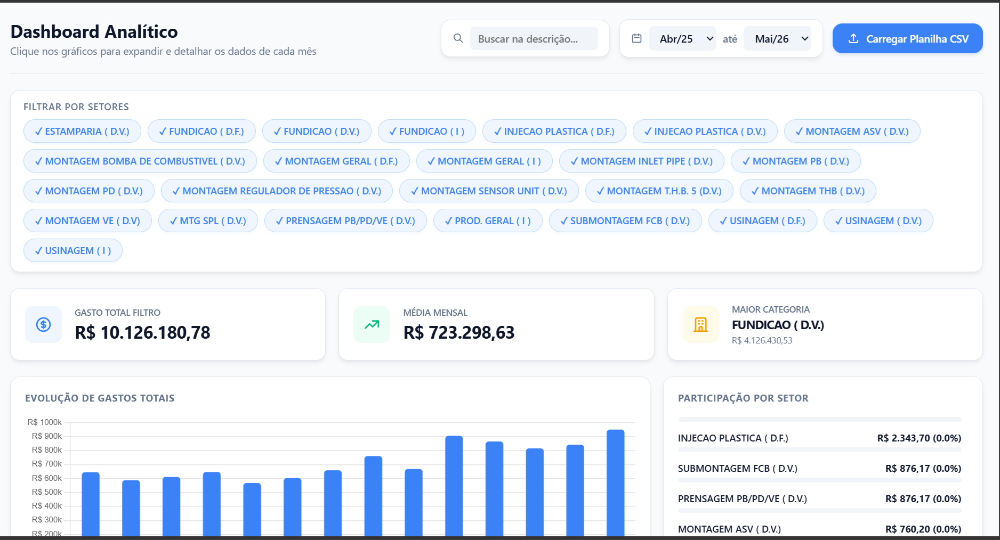

<div align="center">

# 🧠 Uplar Sophia

### Transform CSV into Beautiful Dashboards.

<p>
  <strong>Turn raw spreadsheets into stunning, interactive analytics in seconds.</strong>
</p>


</div>

---

## ✨ About

**Uplar Sophia** is an intelligent analytics platform that transforms **CSV files** into **beautiful dashboards** with interactive charts, KPI cards, advanced filtering, and actionable business insights.

Simply upload your spreadsheet and let Sophia build professional visualizations automatically.

> **Upload CSV → Get Insights.**

---

## 🚀 Features

- 📁 Drag & Drop CSV Upload
- 📊 Automatic Chart Generation
- 📈 KPI Cards
- 🏭 Sector Filtering
- 🔍 Smart Search
- 📅 Date Range Filter
- ⚡ Fast Rendering
- 🎨 Modern UI
- 📱 Responsive Design
- 📂 No Database Required

---

## 🖼 Preview

<p align="center">



</p>

---

## ⚙️ How it works

```text
           CSV File
              │
              ▼
      Data Processing
              │
              ▼
    Automatic Analytics
              │
              ▼
 Beautiful Interactive Dashboard
```

---

## 📊 Built For

- Manufacturing
- Finance
- Cost Analysis
- MES
- ERP Reports
- Business Intelligence
- Operational Analytics

---

## 🧩 Tech Stack

| Technology | Purpose |
|------------|---------|
| HTML5 | Structure |
| CSS3 | Styling |
| JavaScript | Logic |
| Chart.js | Charts |
| PapaParse | CSV Parsing |

---

## 📂 Project Structure

```bash
Uplar-Sophia/
│
├── assets/
│   ├── css/
│   ├── js/
│   ├── icons/
│   └── images/
│
├── index.html
├── preview.png
└── README.md
```

---

## 🎯 Philosophy

> **Data becomes valuable only when it becomes understandable.**

Sophia was created with one goal:

> Transform complex spreadsheets into beautiful dashboards anyone can understand.

---

## 🌟 Why Sophia?

Inspired by **Sophia**, the Greek concept of **Wisdom**, this project turns raw data into meaningful knowledge through elegant visualizations and intuitive analytics.

---

## 📸 Screenshots

| Dashboard | Analytics |
|-----------|-----------|
| *(Add screenshots here)* | *(Add screenshots here)* |

---

## 🚀 Future Roadmap

- [ ] AI Insights
- [ ] PDF Export
- [ ] Excel Export
- [ ] Custom Themes
- [ ] Multi-language
- [ ] Real-Time Data
- [ ] Cloud Sync
- [ ] Authentication
- [ ] Custom Widgets

---

## 🤝 Contributing

Contributions are welcome!

Feel free to fork the project, open issues, or submit pull requests.

---

## 📜 License

Released under the **MIT License**.

---

<div align="center">

### 🧠 Uplar Sophia

**Where Data Becomes Wisdom.**

Made with ❤️ by **Uplar**

</div>
